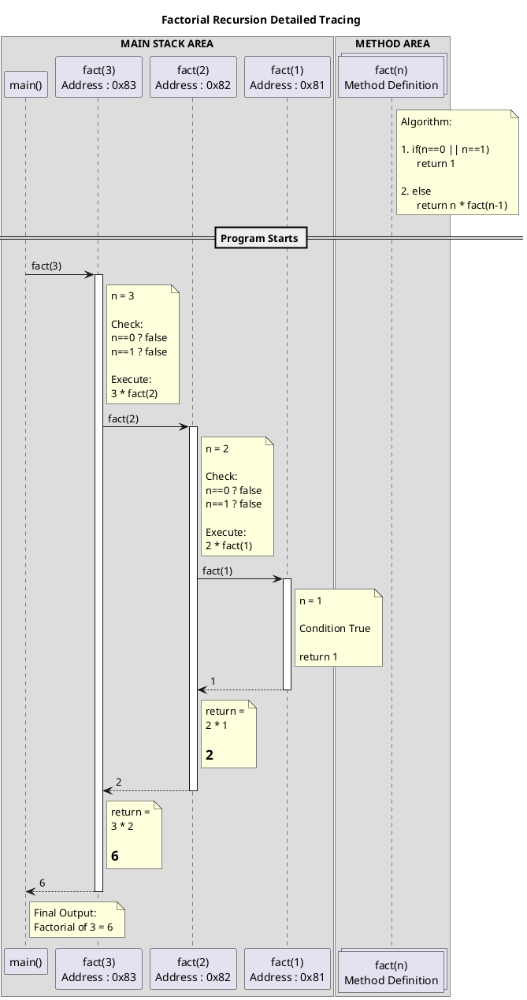

# RECURSION FUN()


# NON LOCAL FUNCTIONS:

`nonlocal b`

is a key word  whichn is used to modify any local variable  inside of the nested function and it is used to refer to the variable which is defined in the nearest enclosing scope which is not global scope

 CODE:

```
def a():
    b=10
    print (b)
    b=100
    print(b)
    def a():
        nonlocal b # is a key word  whichn is used to modify any local variable  inside of the nested function and it is used to refer to the variable which is defined in the nearest enclosing scope which is not global scope
        b=1000
        print(b)
    a()
    print(b)
a()
print(b)
```

```
 OUTPUT :

10100
1000
1000
```


# WHAT IS RECURSION:

DEF:       its a process  of calling the function by itsself untill the given  condition became true

NOTE   ADV :     by using recursion user can achive high eficiency by redusing the number of instructions

NOTE DISS  : the  drawback of recursion itis  taking  more memories inside of the system 


**SYNTAX:**

```
def function_name(args):
     if < condition >:-----
                           |----------------------->>TERMINATION CONDITION
          return value-----
      return fumction_name(args)-------------------->> CALLING SAME FUNCTION
function_name(args)
```





## STEPS OF RECURSION:

1. write the termination condition opposite to  looping condition  in the  form of if statement  and  return the specific value  inside of  termination conditions
2. after the finding the logic as  itis  excluding  updation of the looping variable should be done  inside of recursive  form
